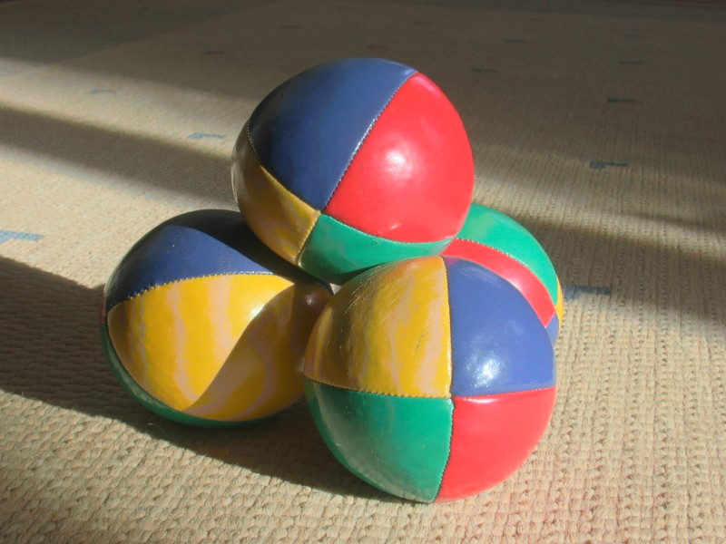
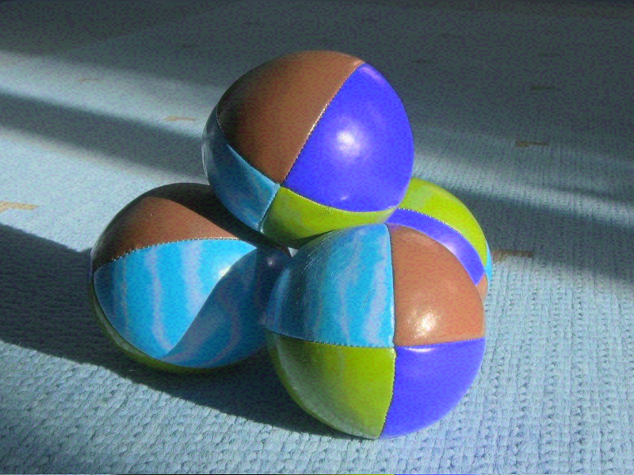

# 343-C-ImageManipulation

**Objectives:**
    - gaining comfort with C
    - understanding pointers

**Assignment:**

Images are just grids of pixels.  The values for the pixels are usually light intensities.  Colors are created by combining the intensity values for multiple colors - often red, green, and blue.  An image of a single pixel then, could be composed of three intensity values.  A 4x4 pixel image would have 16\*3 = 48 intensity values, and so on.

When the intensity values are written to a file, they are converted to one or more bytes depending on the encoding.  A perfectly white pixel is made of full intensities of red, blue, and green.  In the file, it may look like this:

```c
FF FF FF
```

Black, would be 

```c
00 00 00
```

Etc.  We can do image manipulation by loading the bytes from a file into memory, modifying the bytes, and rewriting the file.

For this assignment, you will write a program that will load an image, swap all the red and blue values, and rewrite the image.  If you do this correctly, you will turn



into this:

.

**Background info:**

We aren't going to bother writing a library to load and save images - instead we will use an existing one. I've included the two files you will need in this repo.  They are header-only files, so you won't need to compile them.  Simply have them in the currect directory, and add

```c
#define STB_IMAGE_IMPLEMENTATION
#include "stb_image.h"
#define STB_IMAGE_WRITE_IMPLEMENTATION
#include "stb_image_write.h"
```

to the very top of your file.  Then, you can load an image with:

```c
    const char* file_name = "inputImage.png";
	int width, height, channels;
	unsigned char *image_data = stbi_load(image_path, &width, &height, &channels, 0);

	if (image_data == NULL) {
		printf("Error loading image\n");
		return -1;
	}

	printf("Image loaded: %dx%d, %d channels\n", width, height, channels);
```

And save an image with:

```c
stbi_write_png("outputImage.png", width, height, channels, image_data, width * channels);
stbi_image_free(image_data);
```

The library stores the image data bytes at the location pointed to by ```image_data```.  The data is striped - for each pixel there will be a red, then green, then blue value.  Your job is to write a program that will swap the red and blue for every pixel.

Keep in mind that you can address the data given to you as if it were one long array.  So if you wanted to get the fifth byte, you could write

```c
image_data[5];
```

or

```c
*(image_data + 5);
```

Both of these mean the same thing, and you can use either one you want.  The first way is considered easier to read by most programmers, but do what makes sense to you.

You can solve this problem in multiple ways.  You may want to iterate over each pixel (remembering that each pixel is composed of three bytes), and swap the first and third byte.  Or, you write a helper function that will copy the red channel, then the blue channel, then write them back with the blue first and red third. We aren't going to mess with the green bytes.


